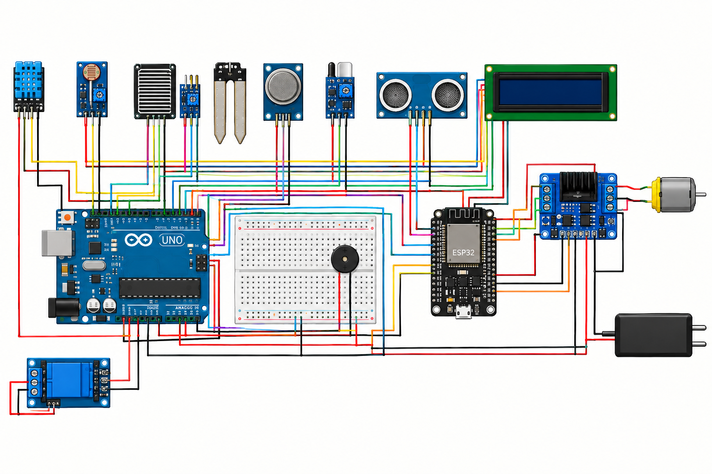
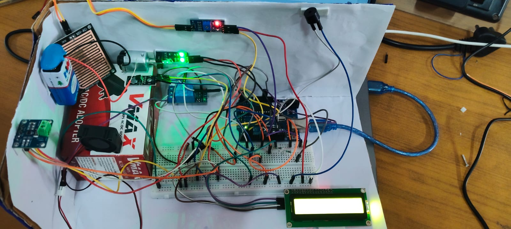
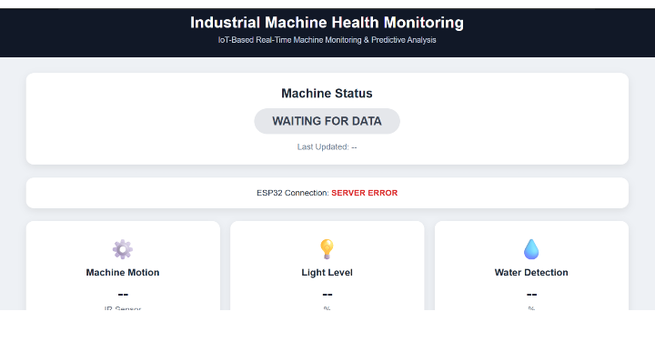

# MotorWatch-IoT-Motor-Health-Monitoring
An IoT-based smart system that monitors motor health in real time using sensors, Arduino, ESP32, and Machine Learning, with a web dashboard for condition and risk monitoring.
**MotorPulse – Smart Condition Monitoring**  
**1\. Introduction**  
MotorPulse is an IoT-based smart condition monitoring system designed to monitor motor health in real time. The system combines sensors, Arduino UNO, ESP32, Flask backend, and Machine Learning to identify abnormal motor conditions.  
**2\. Objective**  
The main objective of MotorPulse is to continuously monitor motor-related parameters, detect abnormal conditions, and display the motor health status through a web dashboard.  
**3\. System Architecture**  
Sensors → Arduino UNO → ESP32 → Flask Backend → Random Forest ML → Web Dashboard  
**4\. Hardware Components**  
Arduino UNO  
ESP32  
IR Sensor  
Rain Sensor  
LDR Sensor  
LCD Display  
Buzzer  
Voltage Divider  
**5\. Software & Technologies**  
Arduino IDE  
Embedded C/C++  
Python  
Flask  
HTML/CSS  
Machine Learning  
Random Forest Algorithm  
**6\. Schematic diagram**  

**7\. Block Diagram**

Working

1. Sensors collect motor and environmental data.
2. Arduino UNO reads and processes the sensor values.
3. ESP32 receives the data and sends it through Wi-Fi.
4. Flask backend receives and processes the data.
5. Random Forest analyzes the input features.
6. The web dashboard displays the motor condition, risk, and confidence.

Output

The system provides:

- Motor RPM
- Rain Status
- Light Status
- Alarm Status
- Machine Condition
- ML Prediction
- Risk Percentage
- Confidence Percentage

Future Scope

- Predictive maintenance
- Cloud data storage
- Mobile application
- More sensors for advanced motor monitoring
- Real-time alerts

  
Final Result

Challebody {nge 

The major challenges were sensor accuracy, hardware integration, real-time data transmission and Machine Learning prediction

Solution 

Sensor readings-ah calibrate panni, multiple readings-ah average eduthu accurate monitoring achieve pannom.

Coding
<!DOCTYPE html>
<html lang="en">

<head>

    <meta charset="UTF-8">

    <meta name="viewport"
          content="width=device-width, initial-scale=1.0">

    <title>Industrial Machine Health Monitoring</title>

    

</head>

<body>

<!-- ================= HEADER ================= -->

<header>

    <h1>
        Industrial Machine Health Monitoring
    </h1>

    

        IoT-Based Real-Time Machine Monitoring & Predictive Analysis
    

</header>

    <!-- ================= MACHINE STATUS ================= -->

    

        <h2>
            Machine Status
        </h2>

        

            WAITING FOR DATA

        

        

            Last Updated:
            
                --
            

        

    

    <!-- ================= CONNECTION ================= -->

    

        ESP32 Connection:

        

            WAITING FOR DATA

        

    

    <!-- ================= SENSOR VALUES ================= -->

    

        <!-- IR SENSOR -->

        

            

                ⚙️
            

            <h3>
                Machine Motion
            </h3>

            

                --

            

            

                IR Sensor
            

        

        <!-- LDR -->

        

            

                💡
            

            <h3>
                Light Level
            </h3>

            

                --

            

            

                %
            

        

        <!-- RAIN -->

        

            

                💧
            

            <h3>
                Water Detection
            </h3>

            

                --

            

            

                %
            

        

    

    <!-- ================= ML ANALYSIS ================= -->

    

        <h2>
            🤖 Machine Condition Analysis
        </h2>

        

            

                <h3>
                    Machine Condition
                </h3>

                

                    --
                

            

            

                <h3>
                    Abnormality Risk
                </h3>

                

                    -- %
                

            

            

                <h3>
                    Analysis Confidence
                </h3>

                

                    -- %
                

            

        

    

    <!-- ================= SENSOR ANALYSIS ================= -->

    

        <h2>
            📊 Live Sensor Analysis
        </h2>

        <!-- MACHINE MOTION -->

        

            

                
                    Machine Motion
                

                
                    0%
                

            

            

                

                

            

        

        <!-- LIGHT -->

        

            

                
                    Light Level
                

                
                    0%
                

            

            

                

                

            

        

        <!-- RAIN -->

        

            

                
                    Water Detection
                

                
                    0%
                

            

            

                

                

            

        

    

    <!-- ================= ALERT ================= -->

    

        <h2 id="alertTitle">
            ⚠️ MACHINE ALERT
        </h2>

        

            Abnormal condition detected.
        

    

<!-- ================= FOOTER ================= -->

<footer>

    Smart Machine Health Monitoring System

     

    Arduino UNO • ESP32 • IoT • Sensor Analytics

</footer>

    try {

        // Get latest data from Flask

        const response =
            await fetch("/api/machine");

        const data =
            await response.json();

        // =================================================
        // CHECK CONNECTION
        // =================================================

        if (!data.connected) {

            document.getElementById(
                "connectionStatus"
            ).innerText =
                "DISCONNECTED";

            document.getElementById(
                "connectionStatus"
            ).className =
                "disconnected";

            document.getElementById(
                "machineStatus"
            ).innerText =
                "NO DATA";

            document.getElementById(
                "machineStatus"
            ).className =
                "disconnected-status";

            document.getElementById(
                "motion"
            ).innerText =
                "--";

            document.getElementById(
                "light"
            ).innerText =
                "--";

            document.getElementById(
                "rain"
            ).innerText =
                "--";

            document.getElementById(
                "prediction"
            ).innerText =
                "NO DATA";

            document.getElementById(
                "risk"
            ).innerText =
                "-- %";

            document.getElementById(
                "confidence"
            ).innerText =
                "-- %";

            document.getElementById(
                "alertBox"
            ).style.display =
                "none";

            return;

        }

        // =================================================
        // SENSOR VALUES
        // =================================================

        const motion =
            Number(data.motion);

        const light =
            Number(data.light);

        const rain =
            Number(data.rain);

        // =================================================
        // DISPLAY SENSOR VALUES
        // =================================================

        if (motion === 1) {

            document.getElementById(
                "motion"
            ).innerText =
                "MOTION";

        }
        else {

            document.getElementById(
                "motion"
            ).innerText =
                "NO MOTION";

        }

        document.getElementById(
            "light"
        ).innerText =
            light;

        document.getElementById(
            "rain"
        ).innerText =
            rain;

        // =================================================
        // MACHINE STATUS
        // =================================================

        const status =
            data.status || "HEALTHY";

        const statusElement =
            document.getElementById(
                "machineStatus"
            );

        statusElement.innerText =
            status;

        statusElement.className =
            "";

        if (status === "HEALTHY") {

            statusElement.classList.add(
                "healthy"
            );

        }

        else if (status === "WARNING") {

            statusElement.classList.add(
                "warning"
            );

        }

        else if (status === "CRITICAL") {

            statusElement.classList.add(
                "critical"
            );

        }

        // =================================================
        // ANALYSIS
        // =================================================

        const prediction =
            data.prediction || status;

        const risk =
            Number(data.risk || 0);

        const confidence =
            Number(data.confidence || 0);

        document.getElementById(
            "prediction"
        ).innerText =
            prediction;

        document.getElementById(
            "risk"
        ).innerText =
            risk.toFixed(1) + " %";

        document.getElementById(
            "confidence"
        ).innerText =
            confidence.toFixed(1) + " %";

        // =================================================
        // SENSOR BARS
        // =================================================

        // IR motion:
        // 0 = no motion
        // 1 = motion

        const motionPercent =
            motion === 1 ? 100 : 0;

        // LDR is already 0-100

        const lightPercent =
            Math.min(
                Math.max(light, 0),
                100
            );

        // Rain is already 0-100

        const rainPercent =
            Math.min(
                Math.max(rain, 0),
                100
            );

        document.getElementById(
            "motionBar"
        ).style.width =
            motionPercent + "%";

        document.getElementById(
            "lightBar"
        ).style.width =
            lightPercent + "%";

        document.getElementById(
            "rainBar"
        ).style.width =
            rainPercent + "%";

        document.getElementById(
            "motionPercentage"
        ).innerText =
            motionPercent + "%";

        document.getElementById(
            "lightPercentage"
        ).innerText =
            lightPercent.toFixed(0) + "%";

        document.getElementById(
            "rainPercentage"
        ).innerText =
            rainPercent.toFixed(0) + "%";

        // =================================================
        // CONNECTION STATUS
        // =================================================

        const connection =
            document.getElementById(
                "connectionStatus"
            );

        connection.innerText =
            "CONNECTED";

        connection.className =
            "connected";

        // =================================================
        // ALERT
        // =================================================

        const alertBox =
            document.getElementById(
                "alertBox"
            );

        const alertMessage =
            document.getElementById(
                "alertMessage"
            );

        const alertTitle =
            document.getElementById(
                "alertTitle"
            );

        if (status === "WARNING") {

            alertBox.style.display =
                "block";

            alertBox.className =
                "alert-warning";

            alertTitle.innerText =
                "⚠️ MACHINE WARNING";

            alertMessage.innerText =
                "Abnormal monitored condition detected. " +
                "Risk level: " +
                risk.toFixed(1) +
                "%";

        }

        else if (status === "CRITICAL") {

            alertBox.style.display =
                "block";

            alertBox.className =
                "alert-critical";

            alertTitle.innerText =
                "🚨 CRITICAL CONDITION";

            alertMessage.innerText =
                "High water/moisture or abnormal " +
                "machine condition detected. " +
                "Risk level: " +
                risk.toFixed(1) +
                "%";

        }

        else {

            alertBox.style.display =
                "none";

        }

        // =================================================
        // LAST UPDATE
        // =================================================

        const now =
            new Date();

        document.getElementById(
            "lastUpdate"
        ).innerText =
            now.toLocaleTimeString();

    }

    catch (error) {

        console.error(
            "Dashboard Error:",
            error
        );

        document.getElementById(
            "connectionStatus"
        ).innerText =
            "SERVER ERROR";

        document.getElementById(
            "connectionStatus"
        ).class

Dashboard 

Authors

GNANESHH D.S

DARSHAN P.T

ARAVIND M

HEMAVARTHIINI V.S

