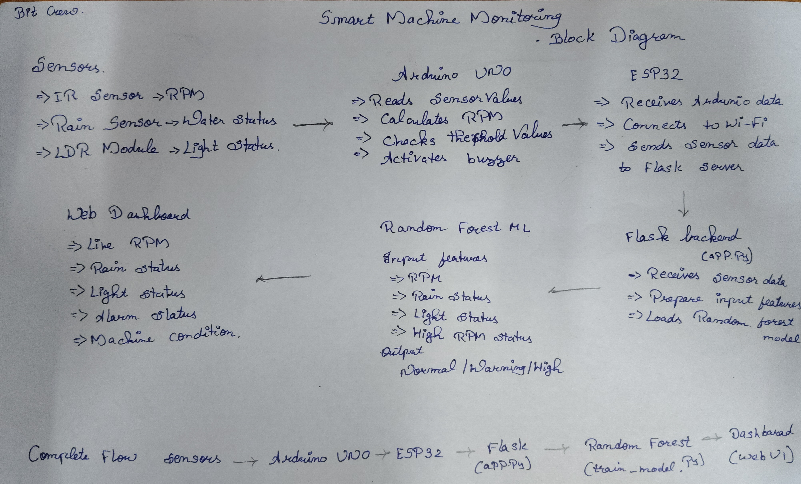

# MotorWatch-IoT-Motor-Health-Monitoring
An IoT-based smart system that monitors motor health in real time using sensors, Arduino, ESP32, and Machine Learning, with a web dashboard for condition and risk monitoring.
**MotorPulse – Smart Condition Monitoring**  
**1\. Introduction**  
MotorPulse is an IoT-based smart condition monitoring system designed to monitor motor health in real time. The system combines sensors, Arduino UNO, ESP32, Flask backend, and Machine Learning to identify abnormal motor conditions.  
**2\. Objective**  
The main objective of MotorPulse is to continuously monitor motor-related parameters, detect abnormal conditions, and display the motor health status through a web dashboard.  
**3\. System Architecture**  
Sensors → Arduino UNO → ESP32 → Flask Backend → Random Forest ML → Web Dashboard  
**4\. Hardware Components**  
Arduino UNO  
ESP32  
IR Sensor  
Rain Sensor  
LDR Sensor  
LCD Display  
Buzzer  
Voltage Divider  
**5\. Software & Technologies**  
Arduino IDE  
Embedded C/C++  
Python  
Flask  
HTML/CSS  
Machine Learning  
Random Forest Algorithm  
**6\. Schematic diagram**  

**7\. Block Diagram**

##  Working

1. Sensors collect motor and environmental data.
2. Arduino UNO reads and processes the sensor values.
3. ESP32 receives the data and sends it through Wi-Fi.
4. Flask backend receives and processes the data.
5. Random Forest analyzes the input features.
6. The web dashboard displays the motor condition, risk, and confidence.

##  Output

The system provides:

- Motor RPM
- Rain Status
- Light Status
- Alarm Status
- Machine Condition
- ML Prediction
- Risk Percentage
- Confidence Percentage

## Future Scope

- Predictive maintenance
- Cloud data storage
- Mobile application
- More sensors for advanced motor monitoring
- Real-time alerts
